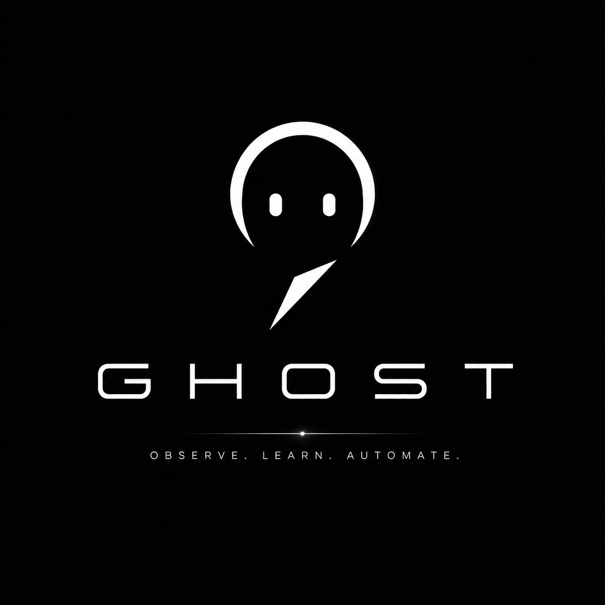

<div align="center">



# GHOST

### Self-Programming Personal Software

**Observe. Learn. Automate.**

GHOST is an experimental AI agent that learns computer workflows by observing how a user interacts with software, storing those actions, and reproducing them later.

</div>

---

## 👻 The Idea

Instead of manually programming every automation, GHOST learns from demonstration.

```text
YOU PERFORM A TASK
        ↓
GHOST OBSERVES
        ↓
STRUCTURES THE ACTIONS
        ↓
STORES THE WORKFLOW
        ↓
REPLAYS IT
        ↓
LEARNS A REUSABLE SKILL
```

The goal is to eventually move from:

> **"Repeat exactly what I did."**

to:

> **"Understand what I was trying to do."**

---

## ⚡ Current Prototype

GHOST currently supports browser-based workflow recording and replay.

- ✅ Records browser navigation
- ✅ Records clicks and text input
- ✅ Converts interactions into structured actions
- ✅ Stores workflows locally with SQLite
- ✅ Retrieves previous workflows
- ✅ Filters duplicate/noisy events
- ✅ Replays recorded workflows with Playwright
- 🚧 AI workflow generalization
- 🚧 Variable extraction
- 🚧 Reusable skill generation
- 🚧 Natural-language commands
- 🚧 Permission system

### Working Example

GHOST observed a user:

```text
Open DuckDuckGo
→ Search "best hardcore bands 2026"
→ Open a result
```

The workflow was stored in memory.

GHOST was then able to open a fresh browser and reproduce the search automatically.

---

## 🧠 Where This Is Going

GHOST currently remembers:

```text
Search for "best hardcore bands 2026"
```

The next goal is for GHOST to understand the pattern:

```text
Search for <query>
```

and turn that demonstration into a reusable skill:

```python
search_web(query)
```

This allows workflows to be learned rather than manually programmed.

---

## 🛠 Tech Stack

- **Python**
- **Playwright**
- **SQLite**
- **Pydantic**
- **FastAPI**

---

## 🚀 Run GHOST

```bash
git clone https://github.com/ChristianBarajas/ghost-ai.git
cd ghost-ai

python3 -m venv .venv
source .venv/bin/activate

pip install -r requirements.txt
playwright install chromium
```

### Record a workflow

```bash
python3 main.py observe "My Workflow"
```

### View GHOST's memory

```bash
python3 main.py show 1
```

### Replay a workflow

```bash
python3 main.py replay 1
```

---

## 🗺 Roadmap

**Phase 1 — Observe & Replay** ✅  
Capture, store, and reproduce browser workflows.

**Phase 2 — Understand** 🚧  
Identify important actions, variables, and repeated patterns.

**Phase 3 — Learn**  
Convert demonstrations into reusable skills.

**Phase 4 — Agent**  
Select and execute learned skills from natural-language requests.

**Phase 5 — Beyond the Browser**  
Learn workflows across the terminal, file system, development tools, and desktop applications.

---

<div align="center">

### 👻 GHOST

**Software that learns how you work.**

Built by Christian Barajas

</div>
