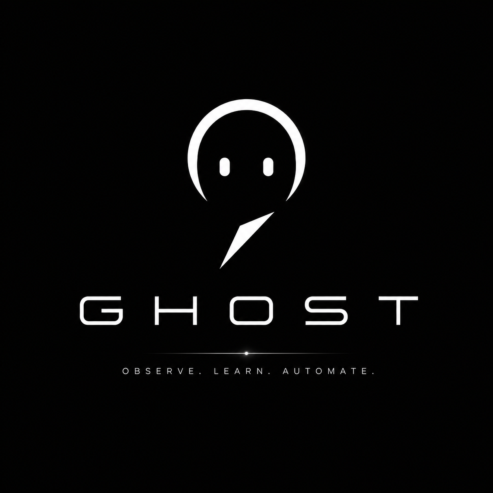

Loading older messages…
(.venv) weegie@Mac ghost % >....                                                         
                    research_result = {
                        "title": page.title(),
                        "url": page.url,
                        "domain": get_domain(
                            page.url
                        ),
                        "content": content,
                    }

                    print(
                        f"✅ Extracted "
                        f"{len(content)} characters."
                    )
'''

if old_extract not in text:
    raise SystemExit(
        "Could not find extract block."
    )

text = text.replace(
    old_extract,
    new_extract,
    1,
)

path.write_text(text)
PY
(.venv) weegie@Mac ghost % python3 -m py_compile ghost/skills/runner.py
(.venv) weegie@Mac ghost % curl -s \
  -X POST \
  http://127.0.0.1:8000/api/agent/run \
  -H "Content-Type: application/json" \
  -d '{
    "request": "Open https://example.com and read the useful content"
  }' | python3 -m json.tool
{
    "routed": true,
    "executed": true,
    "route": {
        "skill": "read_website_content",
        "confidence": 1.0,
        "variables": {
            "url": "https://example.com"
        },
        "missing_variables": [],
        "reason": "The user explicitly asks to open a specified website and read its useful content."
    },
    "task": {
        "task_id": 11,
        "status": "completed",
        "query": "Open https://example.com and read the useful content",
        "provider": "duckduckgo",
        "success": true,
        "verified": true,
        "skill": "read_website_content",
        "result": {
            "title": "Example Domain",
            "url": "https://example.com/",
            "domain": "example.com",
            "content": "This domain is for use in documentation examples without needing permission. This is not a service; avoid relying on it for testing and monitoring purposes.\n\n\u0647\u0630\u0627 \u0627\u0644\u0646\u0637\u0627\u0642 \u0645\u064f\u062e\u0635\u0635 \u0644\u0644\u0627\u0633\u062a\u062e\u062f\u0627\u0645 \u0641\u064a \u0623\u0645\u062b\u0644\u0629 \u0627\u0644\u062a\u0648\u062b\u064a\u0642 \u062f\u0648\u0646 \u0627\u0644\u062d\u0627\u062c\u0629 \u0625\u0644\u0649 \u0625\u0630\u0646. \u0647\u0630\u0647 \u0644\u064a\u0633\u062a \u062e\u062f\u0645\u0629\u060c \u064a\u064f\u0631\u062c\u0649 \u062a\u062c\u0646\u0628 \u0627\u0644\u0627\u0639\u062a\u0645\u0627\u062f \u0639\u0644\u064a\u0647\u0627 \u0644\u0623\u063a\u0631\u0627\u0636 \u0627\u0644\u0627\u062e\u062a\u0628\u0627\u0631 \u0648\u0627\u0644\u0645\u0631\u0627\u0642\u0628\u0629.\n\n\u8be5\u57df\u540d\u4ec5\u7528\u4e8e\u6587\u6863\u793a\u4f8b\uff0c\u65e0\u9700\u83b7\u5f97\u8bb8\u53ef\u3002\u8fd9\u5e76\u975e\u4e00\u9879\u670d\u52a1\uff0c\u8bf7\u52ff\u5c06\u5176\u7528\u4e8e\u6d4b\u8bd5\u548c\u76d1\u63a7\u76ee\u7684\u3002\n\nL\u2019usage de ce domaine est r\u00e9serv\u00e9 \u00e0 des exemples de documentation, sans autorisation pr\u00e9alable. Il ne s\u2019agit pas d\u2019un service ; son utilisation \u00e0 des fins de test ou de surveillance est \u00e0 \u00e9viter.\n\n\u0414\u0430\u043d\u043d\u044b\u0439 \u0434\u043e\u043c\u0435\u043d \u043f\u0440\u0435\u0434\u043d\u0430\u0437\u043d\u0430\u0447\u0435\u043d \u0434\u043b\u044f \u0438\u0441\u043f\u043e\u043b\u044c\u0437\u043e\u0432\u0430\u043d\u0438\u044f \u0432 \u043f\u0440\u0438\u043c\u0435\u0440\u0430\u0445 \u0434\u043e\u043a\u0443\u043c\u0435\u043d\u0442\u0430\u0446\u0438\u0438 \u0431\u0435\u0437 \u043d\u0435\u043e\u0431\u0445\u043e\u0434\u0438\u043c\u043e\u0441\u0442\u0438 \u043f\u043e\u043b\u0443\u0447\u0435\u043d\u0438\u044f \u043f\u0440\u0435\u0434\u0432\u0430\u0440\u0438\u0442\u0435\u043b\u044c\u043d\u043e\u0433\u043e \u0440\u0430\u0437\u0440\u0435\u0448\u0435\u043d\u0438\u044f. \u042d\u0442\u043e \u043d\u0435 \u0441\u0435\u0440\u0432\u0438\u0441; \u043d\u0435 \u0440\u0435\u043a\u043e\u043c\u0435\u043d\u0434\u0443\u0435\u0442\u0441\u044f \u0435\u0433\u043e \u0438\u0441\u043f\u043e\u043b\u044c\u0437\u043e\u0432\u0430\u043d\u0438\u0435 \u0434\u043b\u044f \u0442\u0435\u0441\u0442\u0438\u0440\u043e\u0432\u0430\u043d\u0438\u044f \u0438 \u043c\u043e\u043d\u0438\u0442\u043e\u0440\u0438\u043d\u0433\u0430.\n\nEste dominio est\u00e1 destinado al uso en ejemplos de documentaci\u00f3n sin necesidad de permiso. Esto no es un servicio; evitar utilizarlo para realizar pruebas o monitoreos.\n\nLearn more"
        },
        "error": null,
        "created_at": "2026-10-05 07:28:41",
        "completed_at": "2026-10-05 07:28:43"
    }
}
(.venv) weegie@Mac ghost %
…
Brooo — that’s it. 👻
You just proved the entire learned-skill chain works end to end:

Demonstrations
→ AI generalizes workflow
→ candidate skill created
→ user approves it
→ skill saved
→ router discovers it automatically
→ natural-language request selects it
→ variables extracted
→ generic executor runs it
→ content extracted
→ result verified
→ run saved to memory
And the important part is that we did not hardcode read_website_content into the router or executor by name.
That’s the architectural win.

The learned skill:

read_website_content
was created dynamically, then GHOST later saw:
Open https://example.com and read the useful content
and chose the new skill at 100% confidence, extracted the URL, executed it, and returned:
success: true
verified: true
with the actual page content.
So right now the project has crossed from:

agent with manually-authored skills
into:
agent that can learn a new browser workflow
and then use that learned workflow later
That’s a big deal.
There is one cleanup issue I’d note: the raw page extraction is pretty noisy because it grabs the entire <body> text, including multiple languages and extra content. That’s fine for this proof-of-concept. Later we can improve useful_content extraction so learned skills return cleaner text.

But functionally, this milestone is complete.

Before we do anything else, I’d checkpoint this work:

cd ~/Desktop/ghost

git status

Then likely commit:
git add \
  ghost/skills/learner.py \
  ghost/api/learning.py \
  ghost/api/app.py \
  ghost/skills/runner.py \
  data/skills/read_website_content.json

git commit -m "Add learned skill generation and generic browser execution"

git push origin main

If git status shows anything else, paste it first and I’ll make sure we commit exactly what we want.
cd ~/Desktop/ghostgit status
On branch main
Your branch is up to date with 'origin/main'.

Changes not staged for commit:
  (use "git add <file>..." to update what will be committed)
  (use "git restore <file>..." to discard changes in working directory)
        modified:   frontend/src/App.tsx
        modified:   frontend/src/services/ghostApi.ts
        modified:   frontend/src/types/ghost.ts
        modified:   ghost/api/app.py
        modified:   ghost/skills/runner.py

Untracked files:
  (use "git add <file>..." to include in what will be committed)
        data/skills/read_website_content.json
        ghost/api/learning.py
        ghost/skills/learner.py

no changes added to commit (use "git add" and/or "git commit -a")
…
Yep — that status is exactly what I’d expect right now.
You have two groups of changes:

frontend continuation UI
frontend/src/App.tsx
frontend/src/services/ghostApi.ts
frontend/src/types/ghost.ts
workflow learning + generic learned-skill execution
ghost/api/app.py
ghost/api/learning.py
ghost/skills/learner.py
ghost/skills/runner.py
data/skills/read_website_content.json
So I’d actually commit all of it together, because it’s one cohesive milestone: GHOST can now pause for missing input and learn a new skill from demonstrations and execute it later.
Run this:

cd ~/Desktop/ghost

git add \
  frontend/src/App.tsx \
  frontend/src/services/ghostApi.ts \
  frontend/src/types/ghost.ts \
  ghost/api/app.py \
  ghost/api/learning.py \
  ghost/skills/learner.py \
  ghost/skills/runner.py \
  data/skills/read_website_content.json

git commit -m "Add multi-turn agent flow and learned skill execution"

git push origin main

git status

At the end, we want:
nothing to commit, working tree clean
And at that point, bro, this project has crossed a serious line:
natural language
→ route
→ ask follow-up if needed
→ continue execution
→ learn new skill from examples
→ save skill
→ discover skill automatically
→ execute learned skill
→ verify
→ remember
That’s the cleanest checkpoint we’ve had yet. 👻
So lets summarize what weve done and can we also update the read me on ghost? investigate my current read me and lets update it to what we have rn. and go really in depth with what GHOST does instead of the boring shit like what language it was built with

Worked for 48s
Yeah bro — I pulled up the current GitHub README and it’s definitely time to rewrite it.
The existing README was actually solid for the early GHOST idea, but it’s now materially out of date. It still labels the project as v0.1, lists natural-language skill selection as future work, and even says GHOST cannot select learned skills from unrestricted natural language — all things we’ve now moved past.  

The architecture section is also missing the stuff that now makes GHOST much more interesting: LLM routing, missing-variable handling, resumable execution, the web control center, project verification, explicit learned-skill approval, generic learned browser execution, and task memory. 

And I agree with you: the README should sell the idea and behavior of GHOST, not lead with “Python, React, blah blah.” The languages are implementation details. The interesting part is what the software is becoming.

What we’ve built so far
If you were explaining GHOST to somebody today:
GHOST is experimental self-programming personal software.
Instead of requiring every automation to be manually programmed, GHOST is being built to learn reusable workflows from demonstrations, understand natural-language requests, decide which learned capability applies, collect missing information, execute the workflow, verify whether it actually succeeded, and remember the result.
The long-term goal is software that gradually learns how its user works.
The system now supports this agent loop:
USER REQUEST
      ↓
UNDERSTAND INTENT
      ↓
SELECT A SKILL
      ↓
EXTRACT INPUTS
      ↓
MISSING SOMETHING?
   ↙         ↘
 YES         NO
 ↓            ↓
ASK USER    EXECUTE
 ↓            ↓
RESUME      VERIFY
   ↘         ↙
      MEMORY
And we now also proved this:
DEMONSTRATIONS
      ↓
AI GENERALIZATION
      ↓
DISCOVER VARIABLES
      ↓
GENERATE SEMANTIC SKILL
      ↓
VALIDATE
      ↓
USER APPROVAL
      ↓
SAVE SKILL
      ↓
ROUTER DISCOVERS IT
      ↓
FUTURE REQUEST USES IT
      ↓
EXECUTE + VERIFY
That last part is the real breakthrough from tonight.
GHOST learned:

read_website_content
from two examples.
It inferred that the URL was the changing variable:

url = {{url}}
and created:
navigate → {{url}}
extract → useful_content
Then later, without us adding special router logic for that skill, you asked:
Open https://example.com and read the useful content
and GHOST automatically:
selected read_website_content
→ extracted https://example.com
→ navigated there
→ extracted the page
→ verified success
→ stored the execution
That is exactly the kind of behavior the README should focus on.
Replace the entire README.md with this
# 👻 GHOST

### Self-Programming Personal Software

**Observe. Understand. Learn. Act. Verify. Remember.**

GHOST is an experimental AI agent exploring a different model of personal software:

> What if software could learn how you work instead of requiring you to explicitly program every workflow?

Most automation systems begin with a developer defining the exact procedure the computer should follow.

GHOST is being built in the opposite direction.

The user performs or describes a task. GHOST attempts to understand the underlying goal, separate reusable behavior from incidental actions, represent that behavior as a skill, and later use that skill when a similar need appears.

The long-term goal is software that gradually builds a working model of the user's workflows and becomes capable of handling repetitive computer tasks with explicit permission, observable execution, verification, and memory.

---

# The Core Idea

Traditional automation looks like this:

```text
DEVELOPER WRITES WORKFLOW
        ↓
SOFTWARE EXECUTES WORKFLOW
GHOST is exploring:
USER PERFORMS TASK
        ↓
GHOST OBSERVES
        ↓
STRUCTURES THE BEHAVIOR
        ↓
AI IDENTIFIES THE INTENT
        ↓
REUSABLE PATTERN IS DISCOVERED
        ↓
GHOST CREATES A SKILL
        ↓
USER APPROVES IT
        ↓
GHOST CAN USE IT AGAIN
The goal is not merely:
"Repeat exactly what I clicked."
The goal is:
"Understand what I was trying to accomplish and learn a reusable way to accomplish it again."
That distinction drives the architecture of GHOST.
What GHOST Can Do Today
GHOST has progressed beyond simple recorded browser replay.
The current system contains an AI routing layer, reusable skill system, workflow-learning pipeline, multiple execution engines, verification, persistent task memory, and a browser-based control center.

A user can now describe a task naturally and allow GHOST to determine which available capability should handle it.

For example:

Check if ~/Desktop/ghost is healthy
GHOST can interpret the request as a project-verification task, extract the supplied project path, inspect the repository, determine the technology stack, create a verification plan, execute safe checks, verify the result, and store the completed run.
Or:

What is reinforcement learning?
GHOST can recognize the request as research, route it to a research workflow, search the web, evaluate an external source, extract useful information, generate a concise answer, verify the result, and remember the execution.
The user no longer has to manually decide which internal workflow should run.

Natural-Language Agent Routing
GHOST maintains a library of reusable skills.
When the user submits a request, an LLM reasoning layer receives descriptions of the available skills and determines which capability best matches the user's intent.

The routing process produces structured data:

requested task
      ↓
selected skill
      ↓
confidence
      ↓
extracted variables
      ↓
missing variables
      ↓
reason for selection
Example:
User:
Check if ~/Desktop/ghost is healthy
GHOST may produce:
skill:
verify_project

project_path:
~/Desktop/ghost

confidence:
1.0
The AI does not execute the workflow itself.
Its job is to understand the request, choose the appropriate capability, and extract the information needed by the execution system.

The deterministic GHOST runtime then performs the actual work.

In simplified form:

AI = reasoning / decisions
GHOST runtime = execution / tools
Multi-Turn Agent Execution
GHOST does not invent missing information simply to make a workflow run.
If a user says:

Check if my project is healthy
GHOST understands that the correct skill is:
verify_project
but also recognizes that:
project_path
is missing.
Instead of hallucinating a path or failing the entire task, GHOST pauses execution.

The interface can ask:

Which project should I verify?
The user can respond:
~/Desktop/ghost
GHOST then continues the already-selected workflow.
Importantly, it does not need to route the entire request again.

The sequence becomes:

UNDERSTAND REQUEST
        ↓
SELECT SKILL
        ↓
CHECK REQUIRED INPUTS
        ↓
INPUT MISSING
        ↓
PAUSE
        ↓
ASK USER
        ↓
RECEIVE INPUT
        ↓
RESUME SAME SKILL
        ↓
EXECUTE
        ↓
VERIFY
        ↓
REMEMBER
This gives GHOST the beginnings of persistent multi-turn task execution rather than treating every message as an unrelated prompt.
Learning New

Pasted markdown(20261005-073250).md
Document
wait wait do it off of the logo:
Yep — this is way better. Your current README already has the logo-first identity and the core idea is strong. We should absolutely keep that exact presentation style and rewrite from there instead of replacing it with something generic.
The top should stay centered around the logo, name, tagline, and mission:

<div align="center">



# GHOST

### Self-Programming Personal Software

**Observe. Learn. Automate.**

</div>
That’s already the right vibe.
What’s outdated is mostly everything after that. The README still says v0.1, lists natural-language skill selection as future work, and says GHOST cannot select learned skills from unrestricted natural language — which is no longer true.  

I’d rewrite it to match what GHOST actually is now, while keeping your current visual identity and tone.

Here’s the structure I’d use:

<div align="center">


# GHOST

### Self-Programming Personal Software

**Observe. Learn. Automate.**

GHOST is an experimental AI agent that learns reusable software behavior from demonstrations, understands natural-language requests, selects the right learned capability, collects missing information, executes workflows, verifies success, and remembers what happened.

The long-term goal is simple:

> **Software that learns how you work.**

</div>

---

## 👻 The Idea

Most automation starts with a developer manually defining every step:

```text
DEFINE WORKFLOW
      ↓
WRITE AUTOMATION
      ↓
EXECUTE
GHOST explores a different model:
YOU PERFORM A TASK
        ↓
GHOST OBSERVES
        ↓
STRUCTURES THE ACTIONS
        ↓
STORES THE DEMONSTRATION
        ↓
YOU DEMONSTRATE AGAIN
        ↓
AI COMPARES THE WORKFLOWS
        ↓
GHOST IDENTIFIES THE INTENT
        ↓
GENERALIZES THE REUSABLE BEHAVIOR
        ↓
CREATES A SKILL
        ↓
YOU APPROVE IT
        ↓
GHOST CAN USE IT LATER
The goal is not:
"Repeat exactly what I clicked."
The goal is:
"Understand what I was trying to accomplish and learn how to do it again."
⚡ What GHOST Can Do Right Now
GHOST is no longer just a workflow recorder.
The current system can understand a natural-language task, choose an appropriate capability, extract inputs, ask for missing information, execute the workflow, verify the result, and save the completed run.

Current behavior looks like this:

USER REQUEST
      ↓
UNDERSTAND INTENT
      ↓
SELECT SKILL
      ↓
EXTRACT INPUTS
      ↓
CHECK FOR MISSING INFORMATION
      ↓
EXECUTE
      ↓
VERIFY
      ↓
REMEMBER
If information is missing, GHOST can pause:
USER:
Check if my project is healthy

GHOST:
Which project should I verify?

USER:
~/Desktop/ghost

GHOST:
continues verify_project
→ executes checks
→ verifies
→ saves result
The original routing decision is preserved.
GHOST does not need to reinterpret the entire task again just because one required value was missing.

🧠 Natural-Language Agent Routing
GHOST maintains a library of reusable skills.
When the user submits a task, the AI routing layer receives the available skill definitions and decides which one best matches the request.

For example:

Check if ~/Desktop/ghost is healthy
can become:
skill:
verify_project

variables:
project_path = ~/Desktop/ghost

confidence:
1.0
And:
What is reinforcement learning?
can become:
skill:
research_topic

variables:
query = What is reinforcement learning?
The AI is responsible for understanding and routing.
The actual execution is handled by GHOST's deterministic tools.

AI = reasoning

GHOST runtime = execution
This separation is intentional.
The model chooses what should happen.

The execution system controls how it happens.

🔁 Multi-Turn Agent Execution
GHOST now supports resumable tasks.
A request can begin without all required inputs.

For example:

Check if my project is healthy
GHOST can determine:
skill = verify_project
missing = project_path
Instead of inventing information, GHOST pauses.
The UI then asks:

Which project should I verify?
After the user provides:
~/Desktop/ghost
GHOST resumes the same skill.
UNDERSTAND
    ↓
ROUTE
    ↓
MISSING INPUT
    ↓
PAUSE
    ↓
ASK USER
    ↓
RESUME
    ↓
EXECUTE
    ↓
VERIFY
    ↓
MEMORY
This is the beginning of actual conversational agent state instead of isolated one-shot prompts.
🧬 Learning New Skills From Demonstrations
This is one of the most important capabilities in GHOST.
GHOST can now receive multiple demonstrations and ask the AI reasoning layer to determine what reusable behavior they share.

Example:

Demonstration 1
navigate → https://example.com
extract → useful_content
Demonstration 2
navigate → https://www.python.org
extract → useful_content
GHOST compares those demonstrations and identifies that the changing element is the URL.
It can generalize:

Skill:
read_website_content

Variable:
url

Steps:

navigate → {{url}}
extract  → useful_content
The skill is returned as a candidate first.
It is not silently stored.

The workflow is:

DEMONSTRATIONS
      ↓
AI GENERALIZATION
      ↓
VARIABLE DISCOVERY
      ↓
SEMANTIC WORKFLOW
      ↓
VALIDATION
      ↓
USER APPROVAL
      ↓
SAVE SKILL
That approval step matters.
GHOST is being designed so the AI can propose new behavior without silently rewriting its own capabilities.

👻 GHOST Learned a Skill, Then Used It
The current prototype has already demonstrated the full learning cycle.
GHOST was given two website-reading demonstrations.

From those examples, it generated:

read_website_content
with:
url
as a reusable variable.
The skill was approved and stored.

Later, the user submitted:

Open https://example.com and read the useful content
GHOST automatically:
recognized the intent
      ↓
selected read_website_content
      ↓
extracted the URL
      ↓
executed the learned steps
      ↓
opened the website
      ↓
extracted page content
      ↓
verified completion
      ↓
saved the run
The important part:
No special routing rule was added for that skill.

GHOST discovered the new skill from its own skill library and selected it naturally.

This is the first working version of the project's core idea:

Learn a capability from demonstrations, then use that capability later from natural language.
🧩 Current Skill Library
GHOST currently has reusable skills including:
research_topic
Search for information, open a relevant external source, extract useful content, summarize it, and verify completion.
web_search
Perform a semantic web search using a user-provided query.
verify_project
Inspect a local software project, detect its stack, construct a safe verification plan, run checks, and report whether the project is healthy.
read_website_content
A learned skill generated from demonstrations.
It accepts a URL, opens the site, extracts useful content, and verifies that content was retrieved.

🛠 Project Verification
GHOST can inspect local development projects.
For example:

Check if ~/Desktop/ghost is healthy
GHOST can:
inspect project
      ↓
detect stack
      ↓
discover components
      ↓
build verification plan
      ↓
run safe checks
      ↓
verify success
On the GHOST repository itself, the current verifier detects:
Python
Node
Vite
and runs checks such as:
python -m compileall -q .

npm run build

npm run lint
The execution result is stored in task history.
Failed runs are preserved too.

This means GHOST's memory includes both successful and unsuccessful execution attempts.

🌐 Research Workflows
GHOST can research informational questions.
Example:

What is reinforcement learning?
GHOST can:
route to research_topic
      ↓
search the web
      ↓
inspect results
      ↓
open an external source
      ↓
extract relevant content
      ↓
use AI to summarize
      ↓
verify the source and result
      ↓
save the run
Research is not just a single LLM prompt.
GHOST actually performs a workflow, gathers source material, and then uses the model to reason over the extracted information.

🧠 How GHOST Uses AI
GHOST does not treat the LLM as the entire application.
The model acts as a reasoning layer inside a larger system.

The AI is currently used for:

Skill Routing
Understand a user request and choose the best available skill.
Variable Extraction
Pull required values such as:
project_path
query
url
from natural language.
Missing Input Detection
Recognize when a required value is absent instead of inventing one.
Workflow Generalization
Compare demonstrations and identify:
intent
variables
shared behavior
optional behavior
semantic steps
Research Understanding
Convert extracted webpage content into concise answers and key concepts.
The overall architecture intentionally separates:

reasoning
from
execution
so that AI decisions can be constrained by deterministic tooling.
🧩 Semantic Skills
Literal automation is fragile.
A recorded browser sequence might look like:

scroll 965px
click element #482
scroll 420px
click exact link text
GHOST attempts to store meaning instead:
input   → search_input
submit  → search_input
select  → relevant_result
open    → external_source
extract → useful_content
Or:
navigate → {{url}}
extract  → useful_content
This creates a separation between:
WHAT the workflow means
and:
HOW the executor performs it
That distinction is what allows learned skills to survive different inputs and changing interfaces.
🏗 How GHOST Thinks About Execution
The current system can be understood as:
USER
  ↓
NATURAL LANGUAGE REQUEST
  ↓
AI ROUTER
  ↓
SKILL LIBRARY
  ↓
VARIABLE EXTRACTION
  ↓
MISSING INPUT HANDLING
  ↓
EXECUTOR DISPATCH
  ↓
BROWSER / PROJECT EXECUTION
  ↓
VERIFICATION
  ↓
TASK MEMORY
Skill learning follows a parallel path:
DEMONSTRATIONS
  ↓
AI GENERALIZER
  ↓
SKILL CANDIDATE
  ↓
VALIDATION
  ↓
USER APPROVAL
  ↓
SKILL LIBRARY
These two loops connect.
Once a learned skill enters the skill library, the natural-language router can discover and use it.

💾 Memory
GHOST keeps execution history.
Each run can store:

request
provider
skill
status
success
verification state
result
error
created time
completed time
This means GHOST can remember:
what was attempted
what skill was used
whether it succeeded
what result was produced
The current UI exposes this as Recent Runs.
Memory is not just for display.

Long-term, this execution history can become part of how GHOST learns which workflows are reliable and which need improvement.

🎛 Control Center
GHOST now includes a browser-based agent interface.
From the UI, the user can:

submit natural-language tasks
view AI routing decisions
see confidence scores
provide missing inputs
continue paused tasks
inspect verification results
browse learned skills
inspect skill definitions
view execution history
The interface is designed to expose what the agent is doing instead of hiding the reasoning and execution pipeline behind a single chat response.
⚠️ Current Limitations
GHOST is still an experimental prototype.
The current system is strongest with:

browser workflows
web research
semantic web navigation
local project verification
learned browser actions
It does not yet:
observe every desktop application
learn arbitrary OS workflows
control unrestricted computer actions
perform destructive operations autonomously
generalize every possible browser workflow
operate across every software environment
The workflow-learning system also currently depends on demonstrations being supplied to the learning layer.
Automatic passive observation and continuous skill discovery are part of the larger vision, but are not fully connected to the modern agent flow yet.

Raw webpage extraction can also contain noisy content depending on the site.

🗺 Where GHOST Is Going
The long-term system is intended to evolve toward:
OBSERVE
  ↓
UNDERSTAND
  ↓
LEARN
  ↓
RECOGNIZE
  ↓
SUGGEST
  ↓
APPROVE
  ↓
ACT
  ↓
VERIFY
  ↓
REMEMBER
Observe
Watch how the user performs meaningful workflows.
Understand
Determine what the user was actually trying to accomplish.
Learn
Generalize repeated behavior into reusable skills.
Recognize
Notice when a learned workflow applies to a new situation.
Suggest
Offer to perform repetitive work before the user has to manually repeat it.
Approve
Require explicit permission for meaningful or consequential actions.
Act
Use deterministic execution tools to carry out the workflow.
Verify
Check that the intended outcome actually happened.
Remember
Store the execution and use it to improve future behavior.
🎯 The Long-Term Vision
GHOST is not meant to be another chatbot.
It is not meant to be a collection of manually programmed shortcuts.

And it is not meant to blindly replay mouse movements forever.

The goal is personal software that gradually learns how its user works.

Today:

USER
  ↓
REQUEST
  ↓
GHOST ROUTES
  ↓
GHOST EXECUTES
Eventually:
USER BEHAVIOR
      ↓
OBSERVATION
      ↓
UNDERSTANDING
      ↓
LEARNED SKILLS
      ↓
PATTERN RECOGNITION
      ↓
SUGGESTION
      ↓
PERMISSION
      ↓
AUTOMATION
      ↓
VERIFICATION
      ↓
MEMORY
The
foo give me a brand new read me to paste and also the commands to paste to GitHub
Foo absolutely 😂👻. Keep the logo right at the top and replace the entire README.md with this. I rewrote it around what GHOST actually does and what makes the project interesting, instead of making the README read like a tech-stack assignment. It also updates several things your old README still described as future work, even though they're working now. 
<div align="center">


# GHOST

### Self-Programming Personal Software

**Observe. Understand. Learn. Act. Verify. Remember.**

GHOST is an experimental AI agent exploring a simple question:

> **What if software could learn how you work instead of requiring every workflow to be programmed manually?**

GHOST observes or receives demonstrations of tasks, identifies the underlying intent and reusable behavior, converts that behavior into structured skills, and can later select and execute those skills from natural-language requests.

The long-term goal is personal software that gradually learns a user's workflows and becomes capable of handling repetitive computer tasks while keeping execution visible, permission-controlled, and verifiable.

</div>

---

# 👻 The Idea

Traditional automation usually begins like this:

```text
DEVELOPER DEFINES WORKFLOW
        ↓
SOFTWARE EXECUTES WORKFLOW
GHOST explores a different direction:
USER PERFORMS OR DEMONSTRATES A TASK
                ↓
          GHOST OBSERVES
                ↓
       STRUCTURES THE BEHAVIOR
                ↓
        AI IDENTIFIES INTENT
                ↓
     REUSABLE PATTERN IS FOUND
                ↓
       GHOST PROPOSES A SKILL
                ↓
          USER APPROVES
                ↓
         SKILL IS STORED
                ↓
    GHOST CAN USE IT LATER
The goal is not:
"Repeat exactly what I clicked."
The goal is:
"Understand what I was trying to accomplish and learn a reusable way to do it again."
That distinction is the core of GHOST.
🧠 What GHOST Can Do Right Now
GHOST is no longer only a browser recorder or hardcoded automation script.
The current prototype can:

understand natural-language task requests
choose between available reusable skills using an LLM
extract required variables from what the user said
detect when required information is missing
pause an agent task and ask the user for the missing information
resume the same selected workflow without rerouting the entire request
execute browser-based semantic workflows
execute local software-project verification workflows
search the web and research informational questions
extract webpage content
summarize research using an LLM
verify whether workflows actually succeeded
store execution history in persistent memory
learn reusable workflow candidates from multiple demonstrations
identify changing values and convert them into variables
validate AI-generated workflow definitions before saving them
require explicit approval before learned skills are persisted
automatically discover newly learned skills
route future natural-language requests to those newly learned skills
execute newly learned browser skills without adding custom routing logic for each one
The current agent loop looks like this:
NATURAL-LANGUAGE REQUEST
          ↓
     UNDERSTAND INTENT
          ↓
       SELECT SKILL
          ↓
      EXTRACT INPUTS
          ↓
   ARE INPUTS MISSING?
       ↙         ↘
     YES          NO
      ↓            ↓
   ASK USER      EXECUTE
      ↓            ↓
   RESUME        VERIFY
       ↘          ↙
          MEMORY
🤖 Natural-Language Agent Routing
GHOST maintains a library of reusable skills.
The user does not need to manually choose which internal workflow should handle a task.

For example:

Check if ~/Desktop/ghost is healthy
GHOST can reason that the request belongs to:
verify_project
and extract:
project_path = ~/Desktop/ghost
The routing layer produces structured information such as:
selected skill
confidence
extracted variables
missing variables
reason for selection
The LLM is used as a reasoning layer.
It does not directly control every low-level operation.

A useful way to think about the architecture is:

LLM = BRAIN
GHOST TOOLS = HANDS
The AI determines what capability should be used.
The deterministic execution layer determines how the capability is safely performed.

💬 Multi-Turn Agent Execution
GHOST does not invent missing information just to force a task to run.
For example:

User:
Check if my project is healthy
GHOST understands that the correct skill is:
verify_project
but also understands that the required:
project_path
was never provided.
Instead of hallucinating a path, GHOST pauses.

GHOST:
Which project should I verify?
The user can then answer:
~/Desktop/ghost
GHOST continues the already selected verify_project workflow.
It does not need to send the entire task back through the routing model again.

UNDERSTAND
    ↓
SELECT SKILL
    ↓
MISSING INPUT
    ↓
PAUSE
    ↓
ASK USER
    ↓
RECEIVE INPUT
    ↓
RESUME SAME SKILL
    ↓
EXECUTE
    ↓
VERIFY
    ↓
REMEMBER
This is the beginning of persistent conversational agent behavior rather than isolated single-prompt execution.
🧬 Learning Skills From Demonstrations
One of GHOST's main goals is to learn reusable behavior rather than requiring every skill to be manually authored.
A demonstration contains actions describing how a user accomplished something.

Suppose GHOST sees:

Demonstration 1
Open https://example.com
→ Extract useful webpage content
Demonstration 2
Open https://python.org
→ Extract useful webpage content
The exact URLs are different.
The underlying behavior is the same.

GHOST sends the demonstrations through its workflow-generalization layer.

The model determines that the changing value should become:

url
and generates a candidate skill similar to:
Skill:
read_website_content

Variable:
url

Steps:

navigate → {{url}}
extract  → useful_content
GHOST therefore moves from memorizing:
open example.com
toward learning:
open whatever URL the user provides
That is the core idea behind reusable workflow learning.
🛡 Learned Skills Are Not Automatically Trusted
Allowing an LLM to immediately write executable workflows would be a poor safety model.
GHOST separates:

LEARNING
from:
APPROVAL
The current flow is:
DEMONSTRATIONS
      ↓
AI GENERALIZATION
      ↓
VARIABLE DISCOVERY
      ↓
SEMANTIC WORKFLOW
      ↓
PYTHON VALIDATION
      ↓
SKILL CANDIDATE
      ↓
USER APPROVAL
      ↓
PERSISTED SKILL
The AI proposes.
The GHOST runtime validates.

The user approves.

Only then is the new skill added to the active skill library.

Existing skills are also protected from silent replacement.

A newly generated skill cannot overwrite an existing capability unless replacement is explicitly allowed.

👻 GHOST Learned a Skill During Development
The current prototype has already completed this full cycle.
GHOST was given two demonstrations involving opening different websites and reading their content.

It generated:

read_website_content
with:
Variable:
url
and:
navigate → {{url}}
extract  → useful_content
After approval, the skill was saved into the GHOST skill library.
No special routing rule for read_website_content was added afterward.

The user then submitted:

Open https://example.com and read the useful content
GHOST automatically:
understood the request
        ↓
discovered read_website_content
        ↓
selected it with 100% routing confidence
        ↓
extracted https://example.com
        ↓
executed the learned workflow
        ↓
opened the webpage
        ↓
extracted its content
        ↓
verified the result
        ↓
saved the execution to memory
The skill was not manually selected.
The router discovered and selected the capability from the same skill library used by manually authored workflows.

This demonstrates an important part of the GHOST concept:

A capability can be learned, persisted, discovered, selected, and executed later from a new natural-language request.
🧩 Semantic Skills
Literal recorded automation is fragile.
A raw recording might look like:

scroll 965 pixels

click element #438

wait

scroll 320 pixels

click exact DOM node

open URL
That is tied to the exact state of a website at one moment in time.
GHOST instead attempts to represent the meaning of the workflow.

For example:

input   → search_input
submit  → search_input
select  → relevant_result
open    → external_source
extract → useful_content
Or:
navigate → {{url}}
extract  → useful_content
The skill describes what needs to happen.
The execution layer determines how to perform it in the current environment.

This separation is important because it allows learned workflows to become reusable rather than being recordings of one exact interaction.

🔎 Research Agent
GHOST includes a reusable research workflow.
A request such as:

What is reinforcement learning?
can automatically route to:
research_topic
GHOST can then:
search the web
      ↓
inspect search results
      ↓
choose a relevant external source
      ↓
open the source
      ↓
extract useful content
      ↓
use an LLM to understand the content
      ↓
generate a concise answer
      ↓
verify that a valid external source was reached
      ↓
save the run
A real prototype execution successfully selected an IBM source for a reinforcement-learning question and returned an AI-generated summary based on the extracted source content.
The research system also includes source evaluation and retry behavior rather than blindly accepting the first page returned by a search engine.

💻 Software Project Verification
GHOST is not limited to browser research.
It also includes a separate execution engine for developer-oriented workflows.

The verify_project skill can inspect a local software repository.

Example:

Check if ~/Desktop/ghost is healthy
GHOST can:
inspect repository
      ↓
detect project structure
      ↓
detect technology stack
      ↓
build a safe verification plan
      ↓
run checks
      ↓
inspect results
      ↓
verify project health
      ↓
store execution
For the GHOST repository itself, the verifier has detected:
Python
Node
Vite
and automatically executed safe checks including:
python -m compileall -q .

npm run build

npm run lint
A successful run reported:
3 checks
3 passed
0 failed
GHOST also records the repository's Git status so the result reflects the actual project state at execution time.
This demonstrates the multi-executor architecture:

REQUEST
   ↓
ROUTER
   ↓
SKILL
   ↓
EXECUTOR DISPATCH
   ├── Browser Executor
   └── Project Executor
GHOST is therefore not tied to one automation environment.
🧠 Persistent Memory
GHOST records completed agent runs.
Each execution can retain information such as:

original request
selected skill
execution provider
success
verification status
result
error
created time
completion time
The web interface exposes previous executions as recent runs.
This gives GHOST a persistent record of what it has done rather than treating every interaction as disposable.

The longer-term goal is for this execution history to contribute to a richer model of how the user works.

🏗 How GHOST Thinks About Tasks
The current architecture separates reasoning, skills, execution, verification, and memory.
┌──────────────────────────────┐
│            USER              │
│                              │
│ Natural-language request     │
│ or workflow demonstration    │
└──────────────┬───────────────┘
               ↓
┌──────────────────────────────┐
│        AI REASONING          │
│                              │
│ Understand intent            │
│ Route requests               │
│ Generalize demonstrations    │
│ Extract variables            │
└──────────────┬───────────────┘
               ↓
┌──────────────────────────────┐
│          SKILLS              │
│                              │
│ Reusable semantic behavior   │
│ expressed as structured data │
└──────────────┬───────────────┘
               ↓
┌──────────────────────────────┐
│     EXECUTOR DISPATCHER      │
│                              │
│ Chooses execution engine     │
└──────────┬─────────┬─────────┘
           ↓         ↓
       Browser     Project
       Executor    Executor
           ↓         ↓
           └────┬────┘
                ↓
┌──────────────────────────────┐
│        VERIFICATION          │
│                              │
│ Did the task actually work?  │
└──────────────┬───────────────┘
               ↓
┌──────────────────────────────┐
│           MEMORY             │
│                              │
│ Store execution + result     │
└──────────────────────────────┘
The learning pipeline feeds directly into this same architecture:
DEMONSTRATIONS
      ↓
GENERALIZATION
      ↓
CANDIDATE SKILL
      ↓
VALIDATION
      ↓
APPROVAL
      ↓
SKILL LIBRARY
      ↓
ROUTER CAN DISCOVER IT
That means learned capabilities become part of the same system used by existing capabilities.
🌐 GHOST Control Center
GHOST includes a web interface for interacting with the agent.
The interface currently exposes:

AI Workflow Agent
Submit a task naturally:
What is reinforcement learning?
or:
Check if ~/Desktop/ghost is healthy
AI Routing
See:
selected skill
routing confidence
reasoning summary
extracted inputs
Missing Input Handling
If a required value is absent, GHOST can stop and ask for it.
Execution Results
View research results or software verification reports.
Capabilities
Inspect every skill currently known by GHOST.
Skill Definitions
View:
description
variables
semantic steps
Memory
Inspect previous agent executions and their verification status.
The interface is intended to make GHOST's decisions and actions visible rather than hiding agent behavior behind a black box.

🧠 Current Skill Library
The current prototype includes capabilities such as:
research_topic
Research an informational question using web search and an external source.
web_search
Perform a reusable semantic web search.
verify_project
Inspect and verify the health of a local software project.
read_website_content
A skill generated by GHOST from multiple demonstrations.
The skill library is dynamic.

New approved skill files become discoverable by the system without adding each skill name to the LLM router manually.

🔄 The Bigger GHOST Loop
The long-term vision can be summarized as:
OBSERVE
   ↓
UNDERSTAND
   ↓
LEARN
   ↓
RECOGNIZE
   ↓
SUGGEST
   ↓
APPROVE
   ↓
ACT
   ↓
VERIFY
   ↓
REMEMBER
Several of these pieces already exist individually.
Current progress includes:

OBSERVE       ✅ browser demonstration infrastructure
UNDERSTAND    ✅ LLM intent + workflow reasoning
LEARN         ✅ demonstration → reusable skill
RECOGNIZE     ✅ natural-language skill routing
ASK           ✅ missing-input follow-up
ACT           ✅ browser + project executors
VERIFY        ✅ workflow verification
REMEMBER      ✅ persistent task history
The next major frontier is making those components increasingly autonomous and connected.
🚧 What GHOST Is Not Yet
GHOST is still an experimental prototype.
It is important not to overstate the current system.

GHOST does not yet:

continuously watch everything the user does on their computer
understand every arbitrary desktop workflow
control arbitrary desktop applications
safely execute unrestricted operating-system actions
learn every type of browser interaction
automatically trust AI-generated workflows
autonomously perform sensitive actions without approval
proactively recognize every repeated user behavior
contain a foundation model trained from scratch
fully recover from every unexpected environment or website change
The newest workflow-learning pipeline currently works with structured demonstrations supplied to GHOST.
Browser observation infrastructure also exists, but fully connecting passive observation to automatic skill proposals is still part of the larger vision.

That distinction matters.

GHOST currently demonstrates:

AI-assisted workflow generalization and reusable agent capability learning.
It is not yet a completely autonomous computer-use system.
🗺 Roadmap
Phase 1 — Observe & Replay ✅
Capture browser interactions, structure them into actions, store demonstrations, inspect previous workflows, and reproduce recorded behavior.
Phase 2 — Understand ✅
Compare multiple demonstrations, remove incidental behavior, infer intent, identify variable inputs, and represent workflows semantically.
Phase 3 — Learn ✅
Generate reusable skill candidates from demonstrations, validate them, require approval, and persist accepted capabilities.
Phase 4 — Agent Core ✅
Route natural-language requests to skills, extract inputs, execute workflows, verify results, and remember task history.
Phase 5 — Conversational Agent ✅ / 🚧
Detect missing information, ask follow-up questions, resume execution, and expand toward richer multi-turn planning.
Basic missing-input continuation is working.

More general conversational planning is still being developed.

Phase 6 — Recognition & Proactive Assistance 🚧
Move from:
"Run this task."
toward:
"You usually perform this workflow now.
Would you like me to do it?"
This requires learning when a workflow is relevant, not only how to execute it.
Phase 7 — Beyond the Browser 🚧
Expand reusable execution into:
terminal workflows
file-system operations
development tools
desktop applications
multi-application workflows
All consequential operations should remain permission-controlled.
🎯 Long-Term Vision
GHOST is not intended to be another chatbot wrapper.
The goal is not:

user asks question
      ↓
LLM writes response
The goal is a system that can build reusable operational knowledge from how a user works.
USER BEHAVIOR
      ↓
OBSERVATION
      ↓
STRUCTURED MEMORY
      ↓
GENERALIZATION
      ↓
LEARNED SKILLS
      ↓
CONTEXTUAL RECOGNITION
      ↓
PERMISSION
      ↓
EXECUTION
      ↓
VERIFICATION
      ↓
NEW MEMORY
Over time, GHOST should increasingly understand:
what the user does
why they do it
which parts are repetitive
what information changes
when a workflow is useful
which tools are required
what requires permission
whether execution succeeded
The final vision is personal software that can gradually learn how its user works and turn repeated behavior into reusable capabilities.
🛠 Implementation
The technology exists to support the product idea rather than define it.
GHOST currently uses:

OpenAI LLMs for intent recognition, routing, workflow generalization, and research understanding
Python for the agent runtime, validation, execution, and verification systems
FastAPI for the agent API
React + TypeScript for the GHOST control center
Playwright for browser interaction and workflow execution
SQLite for persistent task and workflow memory
Pydantic for validated structured agent data
JSON skills for portable semantic workflow definitions
The interesting part is how these components interact:
LLM reasoning
+
structured skills
+
deterministic tools
+
verification
+
memory
rather than any individual framework.
🚀 Run GHOST
Clone
git clone https://github.com/ChristianBarajas/ghost-ai.git
cd ghost-ai

Create the Python environment
python3 -m venv .venv
source .venv/bin/activate

pip install -r requirements.txt
playwright install chromium

Configure OpenAI
Create your local environment configuration with:
OPENAI_API_KEY=your_key_here
Never commit API keys.
Load the environment before starting the API:

set -a
source .env
set +a

Start the GHOST API
uvicorn ghost.api.app:app --reload --port 8000

Start the control center
In another terminal:
cd frontend
npm install
npm run dev

Then open the local Vite URL shown in the terminal.
🧪 Example Requests
Research:
What is reinforcement learning?
Project verification:
Check if ~/Desktop/ghost is healthy
Missing-input continuation:
Check if my project is healthy
GHOST can respond:
Which project should I verify?
Learned browser capability:
Open https://example.com and read the useful content
👻 Why GHOST?
Software usually expects people to learn its interface.
GHOST explores the reverse:

Software that learns the user.
Instead of every repeated behavior becoming another manual chore or another script that has to be explicitly engineered, GHOST explores whether those behaviors can gradually become reusable software capabilities.
That is the experiment.

<div align="center">
👻 GHOST
Software that learns how you work.
Built by Christian Barajas

</div> ```
That README now tells someone looking at your repo why this project exists, what the agent actually does, what you proved, and where the idea is going. The old README already had the right central vision of learning intent instead of literal interaction history; this brings the current system up to that vision.

Push it to GitHub
After saving the new README.md in VS Code, run:
cd ~/Desktop/ghost

git status

Assuming your other GHOST work has already been committed and it just shows README.md, run:
git add README.md

git commit -m "Rewrite README for current GHOST agent architecture"

git push origin main

git status

We want the last output to say:
nothing to commit, working tree clean
If git status shows the other files from tonight are still uncommitted, don't run the README-only commit yet—paste the status to me and we'll checkpoint the whole thing cleanly.


<div align="center">


# GHOST

### Self-Programming Personal Software

**Observe. Learn. Automate.**

GHOST is an experimental AI agent that learns browser workflows by observing how a user interacts with software, comparing multiple demonstrations, identifying the user's intent, and converting repeated behavior into reusable skills.

</div>

---

## 👻 The Idea

Most automation requires a developer to manually define every step.

GHOST explores a different approach:

> **What if software could learn a workflow simply by watching you perform it?**

```text

YOU PERFORM A TASK

↓

GHOST OBSERVES

↓

STRUCTURES THE ACTIONS

↓

STORES THE DEMONSTRATION

↓

YOU DEMONSTRATE AGAIN

↓

AI COMPARES THE WORKFLOWS

↓

GHOST IDENTIFIES THE INTENT

↓

GENERATES A REUSABLE SKILL

↓

EXECUTES IT ON NEW INPUTS

↓

VERIFIES COMPLETION

```

The project is moving beyond:

> **"Repeat exactly what I did."**

toward:

> **"Understand what I was trying to accomplish and learn how to do it again."**

---

## ⚡ Current Prototype — GHOST v0.1

GHOST currently supports browser workflow observation, persistent memory, replay, AI-powered workflow generalization, reusable skill generation, and autonomous execution of learned research workflows.

### Observation & Memory

- ✅ Records browser navigation

- ✅ Records clicks and text input

- ✅ Records scrolling behavior

- ✅ Watches newly opened browser tabs

- ✅ Converts interactions into structured actions

- ✅ Filters duplicate and noisy browser events

- ✅ Stores demonstrations locally with SQLite

- ✅ Retrieves and inspects previous workflows

### Workflow Execution

- ✅ Replays recorded browser workflows with Playwright

- ✅ Resolves semantic browser targets such as `search_input`

- ✅ Supports provider-based execution

- ✅ Detects dynamically rendered search results

- ✅ Opens and evaluates external sources

- ✅ Retries when a source is unusable

- ✅ Extracts useful webpage content

- ✅ Verifies successful workflow completion

### AI Learning

- ✅ Compares multiple demonstrations

- ✅ Uses an OpenAI LLM to infer user intent

- ✅ Identifies variable inputs across demonstrations

- ✅ Distinguishes required behavior from optional/noisy actions

- ✅ Generates reusable semantic workflow steps

- ✅ Converts demonstrations into stored GHOST skills

- ✅ Uses AI to analyze and summarize extracted research

- ✅ Falls back to local processing when AI summarization is unavailable

### Future Work

- 🚧 Natural-language skill selection

- 🚧 Permission and approval system

- 🚧 Multi-step workflows beyond research

- 🚧 Cross-application workflow learning

- 🚧 Terminal, file system, and desktop automation

---

## 🧠 Learning From Demonstration

One of GHOST's main goals is to separate a user's **intent** from the exact mouse and keyboard actions used to accomplish it.

For example, GHOST observed two different demonstrations.

### Demonstration 1

```text

Search Bing

→ Enter "what is deep learning"

→ Inspect search results

→ Open an explanatory article

```

### Demonstration 2

```text

Search Bing

→ Enter "what is computer vision"

→ Inspect search results

→ Open an explanatory article

```

The raw demonstrations contain differences:

```text

navigation

clicks

scroll distances

query text

selected result

external source

```

Instead of simply memorizing those actions, GHOST sends the demonstrations through its AI generalization layer.

The model inferred:

```text

Intent:

Find information about a user-provided topic by

searching the web and consulting relevant sources.

Skill:

research_topic

Variable:

query

Semantic workflow:

input → search_input → {{query}}

submit → search_input

select → relevant_result

open → external_source

extract → useful_content

```

GHOST then stores this as a reusable skill.

---

## 🧪 Unseen Workflow Test

After learning `research_topic` from the previous demonstrations, GHOST was given a new query that was not part of the demonstrations:

```bash

python3 main.py run-skill research_topic \

--query "what is artificial general intelligence"

```

GHOST autonomously:

```text

Selected a search provider

↓

Opened the search engine

↓

Entered the unseen query

↓

Detected search results

↓

Selected a relevant result

↓

Opened an external source

↓

Evaluated source quality

↓

Extracted useful content

↓

Used an LLM to summarize the research

↓

Verified successful completion

```

Example successful execution:

```text

👻 FOUND 10 POSSIBLE RESULTS

👻 TRYING RESULT #1

👻 RESULT → Artificial general intelligence - Wikipedia

✅ SOURCE ACCEPTED

👻 QUALITY → source looks useful (relevance=1.00)

🧠 GHOST AI → analyzing research

✅ AI summary generated.

Summary engine: ai

✅ External research source detected.

✅ Research summary generated.

✅ GHOST verified successful completion.

```

This demonstrates that GHOST can execute a learned workflow using an input that was never part of the original demonstrations.

---

## 🏗 Architecture

GHOST is separated into multiple layers so that observation, reasoning, execution, and verification are not handled by one monolithic system.

```text

┌─────────────────────────────┐

│ USER │

│ Demonstrates a task │

└──────────────┬──────────────┘

↓

┌─────────────────────────────┐

│ OBSERVER │

│ Python + Playwright │

│ │

│ Captures browser behavior │

└──────────────┬──────────────┘

↓

┌─────────────────────────────┐

│ MEMORY │

│ SQLite │

│ │

│ Stores demonstrations │

└──────────────┬──────────────┘

↓

┌─────────────────────────────┐

│ AI GENERALIZER │

│ OpenAI LLM │

│ │

│ Infers intent, variables, │

│ and reusable behavior │

└──────────────┬──────────────┘

↓

┌─────────────────────────────┐

│ SKILL │

│ │

│ Semantic representation │

│ of learned behavior │

└──────────────┬──────────────┘

↓

┌─────────────────────────────┐

│ PROVIDER LAYER │

│ │

│ Maps abstract behavior to │

│ execution environments │

└──────────────┬──────────────┘

↓

┌─────────────────────────────┐

│ RUNNER │

│ Python + Playwright │

│ │

│ Executes learned behavior │

└──────────────┬──────────────┘

↓

┌─────────────────────────────┐

│ QUALITY / RETRY │

│ │

│ Rejects unusable results │

│ and retries alternatives │

└──────────────┬──────────────┘

↓

┌─────────────────────────────┐

│ AI PROCESSING │

│ │

│ Understands extracted │

│ information │

└──────────────┬──────────────┘

↓

┌─────────────────────────────┐

│ VERIFICATION │

│ │

│ Confirms the workflow │

│ actually succeeded │

└─────────────────────────────┘

```

---

## 🤖 AI Integration

GHOST does not train its own large language model.

Instead, it integrates an OpenAI LLM as a reasoning layer inside the larger agent architecture.

The LLM is currently used for two primary tasks:

### Workflow Generalization

Given multiple recorded demonstrations, the model identifies:

- the user's likely intent

- values that should become variables

- behavior shared across demonstrations

- optional actions that can be ignored

- semantic steps required to reproduce the task

The model returns structured workflow data that GHOST can convert into an executable skill.

### Research Understanding

After GHOST autonomously opens and extracts content from a useful source, the LLM converts the raw webpage content into a concise answer and meaningful key terms.

If AI processing is unavailable, GHOST can fall back to a local summarization pipeline.

---

## 🧩 Why Semantic Skills?

Recorded browser automation is fragile.

A literal workflow might contain:

```text

scroll 965px

click exact HTML element

navigate

scroll 430px

click another exact element

```

GHOST instead attempts to represent the underlying behavior:

```text

input → search_input

submit → search_input

select → relevant_result

open → external_source

extract → useful_content

```

This allows the execution system to determine **how** to perform an action while the learned skill describes **what** needs to happen.

---

## 🛠 Tech Stack

- **Python** — core application and agent logic

- **Playwright** — browser observation and automation

- **SQLite** — persistent workflow and demonstration memory

- **OpenAI API / LLMs** — workflow reasoning and research understanding

- **Pydantic** — structured workflow and skill models

- **JSON** — persistent semantic skill representation

- **Git / GitHub** — source control and development workflow

---

## 🚀 Run GHOST

### Clone the repository

```bash

git clone https://github.com/ChristianBarajas/ghost-ai.git

cd ghost-ai

```

### Create the environment

```bash

python3 -m venv .venv

source .venv/bin/activate

pip install -r requirements.txt

playwright install chromium

```

### Configure AI

Set your OpenAI API key in your local environment:

```bash

export OPENAI_API_KEY="YOUR_API_KEY"

```

Never commit API keys to the repository.

---

## 👀 Observe a Workflow

```bash

python3 main.py observe "My Workflow"

```

A browser opens.

Perform the task normally, then return to the terminal and press ENTER when finished.

GHOST stores the demonstration in its local workflow memory.

---

## 🧠 Inspect GHOST's Memory

```bash

python3 main.py show 10

```

Example:

```text

[navigate]

[click]

[input]

[navigate]

[scroll]

[click]

[navigate]

```

---

## 🔁 Replay a Workflow

```bash

python3 main.py replay 10

```

GHOST opens a new browser and attempts to reproduce the recorded workflow.

---

## 🧠 Learn From Multiple Demonstrations

```bash

python3 main.py learn-multi 10 11

```

GHOST compares the demonstrations and uses its AI reasoning layer to infer a reusable skill.

Example:

```text

🧠 GHOST AI → analyzing demonstrations

✅ AI workflow pattern detected.

Skill: research_topic

Confidence: 0.98

Variables detected:

- query = "what is deep learning"

Semantic steps:

1. input target=search_input value={{query}}

2. submit target=search_input

3. select target=relevant_result

4. open target=external_source

5. extract target=useful_content

```

The resulting skill is stored under:

```text

data/skills/

```

---

## 👻 Execute a Learned Skill

```bash

python3 main.py run-skill research_topic \

--query "what is artificial general intelligence"

```

GHOST executes the semantic workflow using the new input rather than replaying the original demonstrations literally.

---

## ⚠️ Current Limitations

GHOST is an experimental prototype.

The current system is strongest with browser-based research and search workflows.

It does **not** yet:

- understand arbitrary software workflows

- autonomously operate desktop applications

- execute unrestricted computer actions

- learn every type of browser task

- select any learned skill from unrestricted natural language

- contain its own trained foundation model

Some browser behavior still depends on provider-specific resolution logic, and website changes can affect automation reliability.

The purpose of v0.1 is to validate the central idea:

> **Can multiple human demonstrations be transformed into reusable AI-assisted software behavior?**

The current prototype demonstrates an initial working version of that concept.

---

## 🗺 Roadmap

### Phase 1 — Observe & Replay ✅

Capture, store, inspect, and reproduce browser workflows.

### Phase 2 — Understand ✅

Compare demonstrations, remove noise, identify variable inputs, and infer user intent.

### Phase 3 — Learn ✅

Use AI reasoning to convert multiple demonstrations into reusable semantic skills.

### Phase 4 — Agent 🚧

Select learned skills from natural-language requests, plan multi-step tasks, request permission for sensitive actions, recover from failures, and verify outcomes.

### Phase 5 — Beyond the Browser

Expand workflow learning into:

- terminal commands

- file system operations

- development tools

- desktop applications

- multi-application workflows

---

## 🎯 Long-Term Vision

The long-term goal of GHOST is not simply browser automation.

It is to explore a model of personal software that adapts to the user.

Instead of requiring every workflow to be explicitly programmed:

```text

USER BEHAVIOR

↓

OBSERVATION

↓

MEMORY

↓

GENERALIZATION

↓

LEARNED SKILLS

↓

PERMISSION

↓

AUTOMATION

```

GHOST aims to move toward software that can learn **how a user works**, build reusable knowledge from those demonstrations, and assist with repetitive workflows while keeping execution visible and permission-controlled.

---

<div align="center">

### 👻 GHOST

**Software that learns how you work.**

Built by Christian Barajas

</div>
